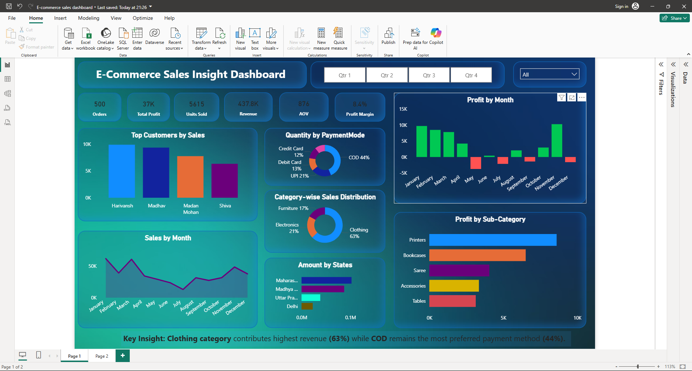

#  E-Commerce Sales Insight Dashboard

##  Overview
This project presents an interactive Power BI dashboard to analyze sales performance, customer behavior, and business trends. The dashboard provides insights to support data-driven decision-making.

---

##  Tools Used
- Power BI  
- DAX  
- Excel  

---

##  Key Metrics (KPIs)
- Revenue  
- Orders  
- Units Sold  
- Average Order Value (AOV)  
- Profit Margin  

---

##  Dashboard Preview

---

##  Key Insights
- Clothing category contributes the highest revenue (63%)  
- Cash on Delivery (COD) is the most preferred payment method (44%)  
- Sales show variation across months with peak performance during certain periods  
- A small group of customers contributes significantly to overall revenue  

---

##  Files Included
- `dashboard.png` – Dashboard screenshot  

---

##  Project Highlights
- Built interactive dashboard using Power BI  
- Created DAX measures (SUM, DISTINCTCOUNT, DIVIDE)  
- Designed KPI cards for business metrics  
- Applied conditional formatting for profit/loss analysis  
- Enabled interactive filtering for better user experience  

